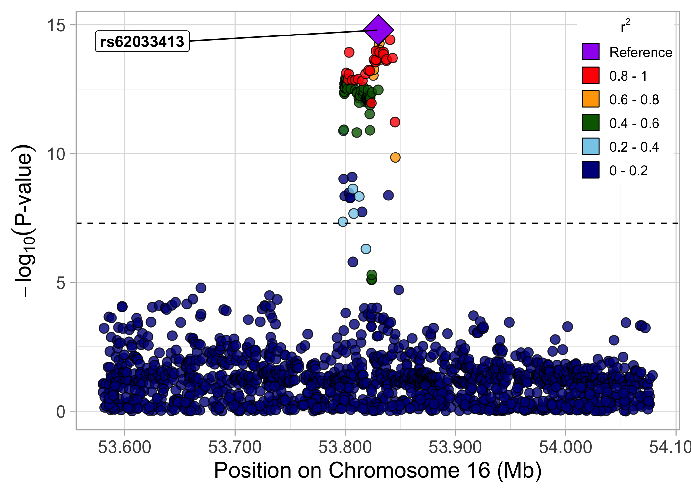
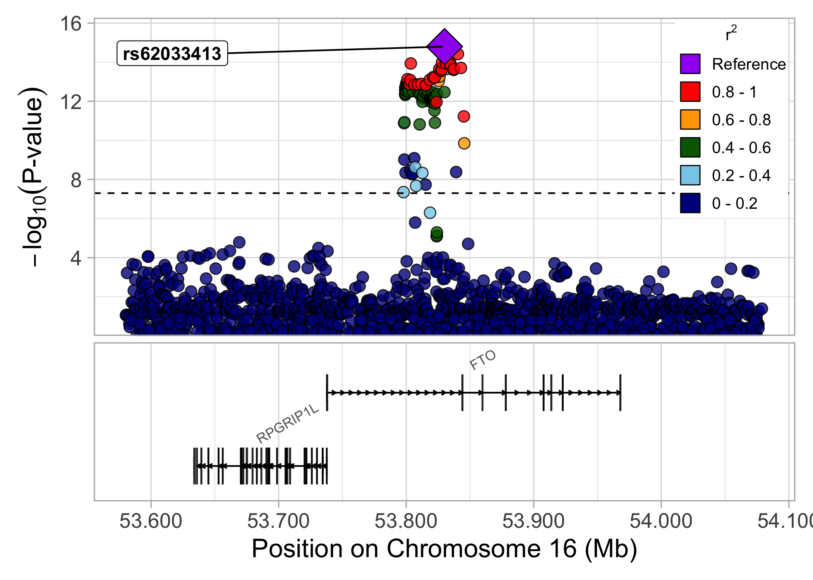

<!-- README.md is generated from README.Rmd. Please edit that file -->

# locusplotr 

<!-- badges: start -->

[](https://lifecycle.r-lib.org/articles/stages.html#experimental)
[](https://github.com/mglev1n/locusplotr/actions)
<!-- badges: end -->

The goal of `locusplotr` is to allow users to integrate genome-wide
association study results with linkage disequilibrium data to create
regional association plots surrounding a genomic locus of interest. The
`gg_locusplot` function allows the user to provide GWAS summary
statistics for a region of interest and a reference/sentinel/lead
variant within that region, and will return a ggplot object with a
regional association plot. In the background, this package uses a helper
function named `ld_extract_locuszoom` to query the University of
Michigan LocusZoom API (<https://portaldev.sph.umich.edu/>) to obtain
linkage disequilibrium data for a genetic variant and genomic region of
interest (allowing the user to specify genome build and genetic
ancestry).

## Installation

You can install `locusplotr` from [GitHub](https://github.com/):

``` r
# install.packages("devtools")
devtools::install_github("mglev1n/locusplotr")
```

## Usage

Start with a dataframe containing genome wide association study summary
statistics at a locus of interest

``` r
library(locusplotr)

fto_locus_df
#> # A tibble: 19,119 × 9
#>    chromosome position rsid    effect_allele other_allele    eaf  effect std_err
#>         <dbl>    <dbl> <chr>   <chr>         <chr>         <dbl>   <dbl>   <dbl>
#>  1         16 53532568 rs1503… A             C            0.996  -0.279   0.196 
#>  2         16 54016452 rs1722… A             G            0.909  -0.0269  0.0122
#>  3         16 53710931 rs1454… A             G            0.982  -0.0212  0.104 
#>  4         16 54069480 rs3717… T             C            0.001  -1.38    1.04  
#>  5         16 53371872 rs5337… T             C            0.0019  0.0681  0.508 
#>  6         16 53838423 rs1162… T             C            0.0221  0.0116  0.0985
#>  7         16 53610642 rs1131… T             C            0.149   0.0364  0.0099
#>  8         16 53494581 rs5350… A             G            0.997   0.264   0.170 
#>  9         16 54248221 rs5576… A             T            0.0476 -0.0527  0.0709
#> 10         16 53549981 <NA>    A             G            0.0004  1.50    0.518 
#> # … with 19,109 more rows, and 1 more variable: p_value <dbl>
```

Use the `gg_locusplot` function to create a regional association plot.
This calls the `ld_extract_locuszoom` function in the background to
fetch linkage disequilibrium data from the University of Michigan
LocusZoom API <https://portaldev.sph.umich.edu/>.

``` r
library(tidyverse)

fto_locus_df %>%
  gg_locusplot(
    lead_snp = "rs62033413",
    rsid = rsid,
    chromosome = chromosome,
    position = position,
    ref = effect_allele,
    alt = other_allele,
    p_value = p_value
  )
```



Use the `plot_genes` argument to include a plot of genes within the
region beneath the main regional association plot.

``` r
gg_locusplot(
  df = fto_locus_df,
  lead_snp = "rs62033413",
  rsid = rsid,
  chromosome = chromosome,
  position = position,
  ref = effect_allele,
  alt = other_allele,
  p_value = p_value,
  plot_genes = TRUE
)
```


Additional arguments allow the user to specify the genome build (GRCh37,
GRCH38), population (Eg. ALL, AMR, AFR, EUR, EAS, etc.), plot
title/subtitle, and directory to save the regional association plot as a
.pdf.

The `ld_extract_locuszoom` function, called in the background by
`gg_locusplot`, can also be used to retrieve linkage disequilibrium data
for a genetic variant and genomic region of interest. The user may again
specify genome build, population, and the specific linkage
disequilibrium metric (Eg. r, rsquare, cov)

``` r
ld_extract_locuszoom(chrom = 16, pos = 53830055, ref = "C", alt = "G", start = 53830055 - 5e5, stop = 53830055 + 5e5, build = "GRCh37", population = "ALL", metric = "rsquare")
#> # A tibble: 28,455 × 7
#>    variant1        chromosome1 position1 variant2 chromosome2 position2 correlation
#>    <chr>                 <dbl>     <int> <chr>          <dbl>     <int>       <dbl>
#>  1 16:53830055_C/G          16  53830055 16:5333…          16  53330083   0.000613 
#>  2 16:53830055_C/G          16  53830055 16:5333…          16  53330091   0.00328  
#>  3 16:53830055_C/G          16  53830055 16:5333…          16  53330128   0.0000874
#>  4 16:53830055_C/G          16  53830055 16:5333…          16  53330136   0.0000592
#>  5 16:53830055_C/G          16  53830055 16:5333…          16  53330148   0.00364  
#>  6 16:53830055_C/G          16  53830055 16:5333…          16  53330184   0.000674 
#>  7 16:53830055_C/G          16  53830055 16:5333…          16  53330263   0.000118 
#>  8 16:53830055_C/G          16  53830055 16:5333…          16  53330336   0.0000592
#>  9 16:53830055_C/G          16  53830055 16:5333…          16  53330401   0.000618 
#> 10 16:53830055_C/G          16  53830055 16:5333…          16  53330445   0.00202  
#> # … with 28,445 more rows
```
